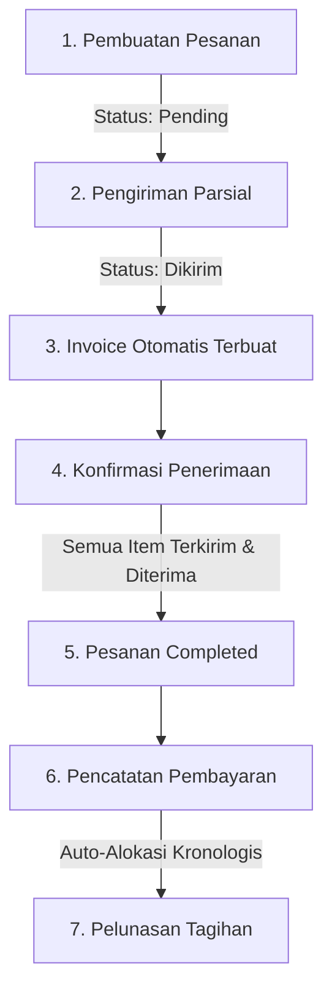

# Panduan Alur Sistem (User Flow) - Wira Teknik

Dokumen ini menjelaskan alur kerja (*workflow*) sistem backend **Wira Teknik** dari sudut pandang pengguna (Admin/Owner) sejak pencatatan pesanan hingga penyelesaian pembayaran.

---

## Lini Masa Alur Kerja Utama (End-to-End Flow)

---

## Penjelasan Detil Tiap Tahap

### 1. Manajemen Pelanggan & Pembuatan Pesanan (Order)
1. **Registrasi Pelanggan**: Admin mendaftarkan profil perusahaan pelanggan baru (nama, alamat, kontak, email).
2. **Pencatatan Pesanan**: Admin membuat pesanan baru (`POST /api/v1/orders`) dengan mencantumkan item barang, kuantitas, harga satuan, dan tanggal pesanan (`order_date`).
   * **Status Awal**: Pesanan yang baru dibuat akan mendapatkan status `pending`.
   * **Aturan Penghapusan**: Pesanan **hanya dapat dihapus** oleh Admin jika statusnya masih `pending`. Jika pesanan sudah mulai diproses (dikirim sebagian/seluruhnya), pesanan tidak dapat dihapus.

### 2. Pengiriman Barang (Shipment) & Pembuatan Tagihan (Invoice)
1. **Pengiriman Parsial**: Admin mengirimkan sebagian atau seluruh barang pesanan (`POST /api/v1/shipments`) dengan mengunggah dokumen wajib (*Surat Jalan*, *Bukti Kirim*, dan *Bon Pesanan*).
   * **Validasi Tanggal**: Tanggal pengiriman (`shipping_date`) **tidak boleh sebelum** tanggal pesanan dibuat (`order_date`).
   * **Status Pengiriman**: Saat dibuat, pengiriman berstatus `dikirim`.
2. **Otomatisasi Invoice**: Ketika pengiriman berhasil dicatat, sistem secara otomatis menerbitkan **Invoice** khusus untuk pengiriman tersebut (`INV-YYYYMMDD-XXXX`) dengan total nominal tagihan termasuk PPN 11%.
3. **Perubahan Status Pesanan**: 
   * Jika baru sebagian barang terkirim, status pesanan otomatis berubah menjadi `partial`.
   * Jika seluruh barang telah dikirim, status pesanan otomatis berubah menjadi `shipped`.

### 3. Konfirmasi Penerimaan Pengiriman
1. **Konfirmasi Fisik**: Setelah barang sampai di lokasi pelanggan, Admin memperbarui status pengiriman menjadi diterima (`PATCH /api/v1/shipments/:id/received`).
   * **Status Pengiriman**: Berubah menjadi `diterima`.
   * **Status Pesanan**: Jika semua pengiriman untuk pesanan tersebut telah terkonfirmasi `diterima` **dan** tidak ada sisa kuantitas barang yang belum terkirim, status pesanan otomatis diperbarui menjadi `completed`.

### 4. Proses Pembayaran Tagihan (Payment)
1. **Penerimaan Pembayaran**: Admin mencatat uang masuk dari customer (`POST /api/v1/payments`) dengan mengunggah bukti bayar dan mencantumkan daftar pesanan (*Order IDs*) yang dibayar.
2. **Alokasi Otomatis (Auto-Allocation)**: Sistem secara otomatis membagi dana pembayaran tersebut ke tagihan (*invoices*) dari pesanan terkait, mendahulukan tagihan yang terbit paling lama (kronologis).
3. **Edit Pembayaran**: Jika nominal atau alokasi pesanan diubah (`PUT /api/v1/payments/:id`):
   * Sistem akan **membatalkan (revert)** sisa saldo tagihan lama terlebih dahulu ke kondisi sebelum pembayaran.
   * Sistem kemudian mengalokasikan ulang nominal pembayaran baru secara kronologis ke daftar pesanan yang baru dipilih.
4. **Status Pelunasan**: Tagihan (*invoice*) akan berstatus `unpaid`, `partial`, atau `paid` (lunas) sesuai dengan kecukupan dana pembayaran yang masuk.

---

## Monitoring pada Dashboard

Pengguna (Admin & Owner) dapat memantau aktivitas operasional secara *real-time* di Dashboard (`GET /api/v1/dashboard`):
* **Metrik Utama**: Memantau jumlah total pesanan, pesanan diproses, pesanan selesai, jumlah pengiriman berlangsung/selesai, serta total nominal tagihan yang belum lunas.
* **Lini Masa Aktivitas (Activity Timeline)**: Menampilkan urutan kejadian historis secara kronologis tanpa saling menimpa:
  * **Pesanan**: `Pesanan Baru` (saat dibuat) $\rightarrow$ `Pesanan Selesai` (saat selesai dikirim & lunas).
  * **Pengiriman**: `Pengiriman Terkonfirmasi` (saat dikirim) $\rightarrow$ `Pengiriman Selesai` (saat barang diterima).
  * **Pembayaran**: `Pembayaran Diterima` (saat dicatat) $\rightarrow$ `Pembayaran Diperbarui` (jika nominal diedit).
