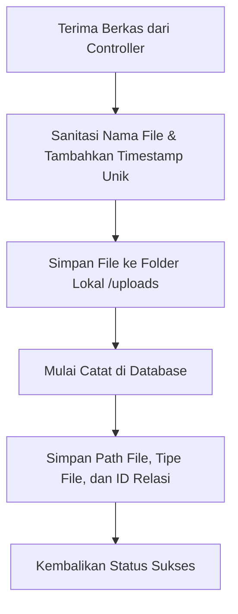

# Penjelasan Logika Bisnis: Attachment Service (`attachment_service.go`)

Berkas ini mengelola penyimpanan fisik dan relasi database untuk berkas lampiran pendukung transaksi (seperti Surat Jalan, Bukti Kirim, Bon Pesanan, dan Bukti Transfer).

---

## 1. Tanggung Jawab Utama
Layanan ini memiliki tanggung jawab utama:
1. **Mengunggah Lampiran (`UploadAttachment`)**: Menerima file multipart dari klien, melakukan sanitasi nama berkas, menyimpan file ke dalam folder penyimpanan server, dan mencatat informasinya di database.
2. **Mengambil Daftar Lampiran (`GetAttachments`)**: Mengembalikan daftar tautan file yang berasosiasi dengan ID transaksi tertentu (misalnya ID pengiriman atau ID pembayaran).

---

## 2. Diagram Alur Logika (Flowchart)

---

## 3. Komponen Teknis Penting untuk Sidang Skripsi

1. **Penyimpanan Berkas Terstruktur**:
   * Setiap file yang diunggah dipisahkan berdasarkan kategorinya (misalnya `surat_jalan`, `bukti_kirim`, `bon`, `bukti_transfer`) untuk mempermudah pencarian berkas fisik di server.
2. **Pencegahan Overwrite File (Unique Naming)**:
   * Nama file asli disanitasi dari spasi dan karakter khusus, kemudian digabungkan dengan Unix timestamp unik sebelum disimpan di server. Hal ini menjamin tidak akan ada berkas yang tertimpa secara tidak sengaja jika terdapat berkas dengan nama yang sama diunggah oleh Admin berbeda.
3. **Konsep Polimorfisme Relasi Lampiran (`related_id`)**:
   * Tabel `attachments` menggunakan satu kolom `related_id` bertipe UUID untuk menghubungkan file lampiran ke berbagai tabel berbeda (dapat merujuk ke ID pada tabel `shipments` maupun ID pada tabel `payments`). Ini menyederhanakan struktur database tanpa perlu membuat banyak tabel lampiran terpisah.
