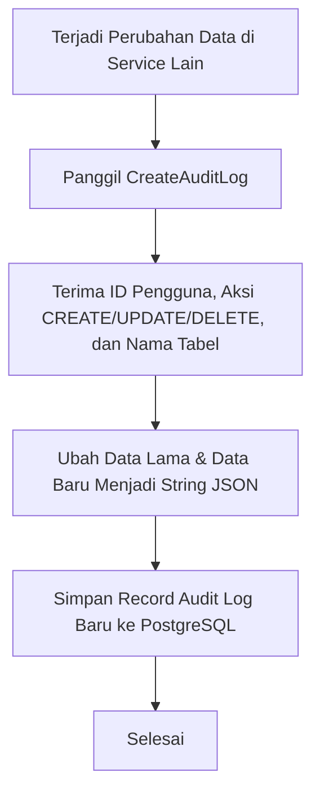

# Penjelasan Logika Bisnis: Audit Service (`audit_service.go`)

Berkas ini mengelola perekaman riwayat aktivitas keamanan dan transaksi sensitif (log audit) untuk keperluan pengawasan data.

---

## 1. Tanggung Jawab Utama
Layanan ini memiliki tanggung jawab utama:
1. **Mencatat Log Audit (`CreateAuditLog`)**: Merekam aksi penulisan, pengeditan, atau penghapusan data penting yang dilakukan oleh pengguna.
2. **Membaca Log Audit (`GetAuditLogs`)**: Menampilkan daftar log audit secara terurut (terbaru dahulu) yang **khusus dibatasi** untuk akun berhak akses `owner`.

---

## 2. Diagram Alur Logika (Flowchart)

---

## 3. Komponen Teknis Penting untuk Sidang Skripsi

1. **Penyimpanan State Data Sebelum & Sesudah Perubahan (Before-After Snapshot)**:
   * Setiap log audit tidak hanya menyimpan teks keterangan biasa, melainkan menyimpan salinan objek data utuh sebelum diubah (*before state*) dan sesudah diubah (*after state*) dalam bentuk format teks string JSON di database. Ini sangat membantu pelacakan jika ada kesalahan entri data oleh Admin karena nilai sebelumnya dapat dilihat kembali secara presisi.
2. **Kategori Aksi Audit**:
   * Sistem mengelompokkan aksi audit ke dalam konstanta ketat:
     * `CREATE`: Pembuatan data baru.
     * `UPDATE`: Penyuntingan data lama.
     * `DELETE`: Penghapusan data.
3. **Pembatasan Hak Akses Khusus (RBAC Otorisasi)**:
   * Data audit log merupakan informasi sensitif perusahaan. Sistem melindunginya menggunakan middleware otorisasi level role `owner` pada tingkat rute API. Akun level `admin` biasa diblokir dari melihat isi riwayat log audit ini.
