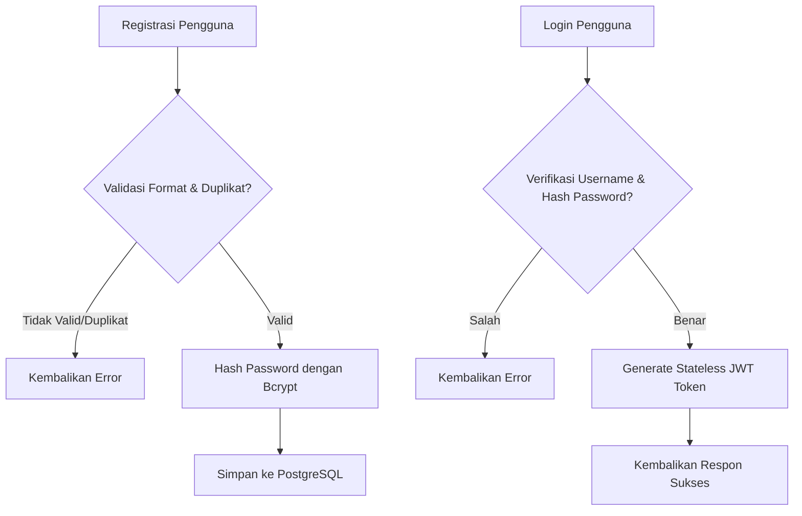
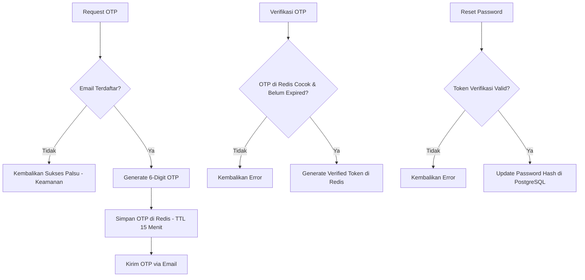

# Penjelasan Logika Bisnis: Auth Service (`auth_service.go`)

Berkas ini mengelola seluruh fungsionalitas autentikasi (keamanan masuk sistem) dan otorisasi (pembatasan hak akses).

---

## 1. Tanggung Jawab Utama
Layanan ini memiliki tanggung jawab utama:
1. **Registrasi Pengguna Baru (`RegisterUser`)**: Mendaftarkan Admin atau Owner baru dengan validasi keamanan.
2. **Autentikasi Masuk (`LoginUser`)**: Memverifikasi identitas pengguna berdasarkan nama pengguna (*username*) dan kata sandi (*password*).
3. **Mekanisme Lupa Sandi (`ForgotPassword...`)**: Membantu pengguna memulihkan kata sandi dengan verifikasi kode OTP (*One-Time Password*) via Email.

---

## 2. Diagram Alur Logika (Flowchart)

### Alur Registrasi & Login

### Alur Lupa Sandi (OTP)

---

## 3. Komponen Teknis Penting untuk Sidang Skripsi

1. **Hashing Bcrypt (`bcrypt.GenerateFromPassword`)**: 
   * Sandi pengguna **tidak pernah** disimpan dalam bentuk teks biasa di database. Sistem menggunakan algoritma adaptif *Bcrypt* dengan biaya enkripsi default untuk mengamankan data sandi dari pencurian database.
2. **Stateless JWT (JSON Web Token)**: 
   * Setelah verifikasi login sukses, backend membuat token JWT yang berisi ID, Email, dan Role pengguna. Token ini dikirim kembali ke klien untuk digunakan pada request berikutnya. Backend tidak perlu menyimpan session di database (skalabilitas tinggi).
3. **Penyimpanan Kode OTP di Redis**:
   * OTP lupa sandi disimpan di database memory cache **Redis** dengan batas kedaluwarsa (*Time-To-Live / TTL*) selama 15 menit. Jika lewat dari 15 menit, data terhapus otomatis dari Redis untuk keamanan ekstra.
4. **Proteksi User Enumeration**:
   * Saat melakukan request OTP lupa sandi, jika email tidak ditemukan di database, sistem tetap mengembalikan respon sukses umum tanpa memberi tahu bahwa email tidak ada. Hal ini mencegah *attacker* melacak daftar email pengguna yang terdaftar di sistem.
