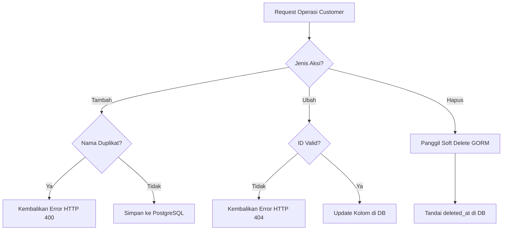

# Penjelasan Logika Bisnis: Customer Service (`customer_service.go`)

Berkas ini mengelola operasi CRUD (*Create, Read, Update, Delete*) data profil pelanggan (customer).

---

## 1. Tanggung Jawab Utama
Layanan ini memiliki tanggung jawab utama:
1. **Membuat Data Pelanggan (`CreateCustomer`)**: Mendaftarkan nama perusahaan, alamat, email, dan telepon pelanggan.
2. **Membaca Data Pelanggan (`GetCustomerByID`, `GetAllCustomers`)**: Menampilkan daftar pelanggan dengan paging, pencarian, dan filter tanggal.
3. **Mengubah Data Pelanggan (`UpdateCustomer`)**: Memperbarui informasi profil pelanggan yang sudah ada.
4. **Menghapus Data Pelanggan (`DeleteCustomer`)**: Menghapus data pelanggan dari sistem menggunakan metode pengamanan data (*Soft Delete*).

---

## 2. Diagram Alur Logika (Flowchart)

---

## 3. Komponen Teknis Penting untuk Sidang Skripsi

1. **Validasi Unik Nama Pelanggan**:
   * Sistem mencegah duplikasi data pelanggan dengan melakukan query pencocokan nama secara *case-insensitive* sebelum menyimpan data baru.
2. **Soft Delete (GORM DeletedAt)**:
   * Penghapusan data pelanggan tidak menggunakan query `DELETE FROM` fisik melainkan diisi tanggal penghapusannya pada kolom `deleted_at`. Data tidak akan muncul dalam query normal, namun riwayat transaksi pesanan lama dari pelanggan tersebut tetap terjaga integritasnya di database (tidak merusak relasi foreign key).
3. **Pencarian Pencocokan Parsial (ILike Query)**:
   * Pencarian daftar pelanggan menggunakan operator pencarian teks parsial `ILIKE` di PostgreSQL sehingga memudahkan pengguna menemukan nama pelanggan walaupun hanya mengetikkan sebagian kata.
