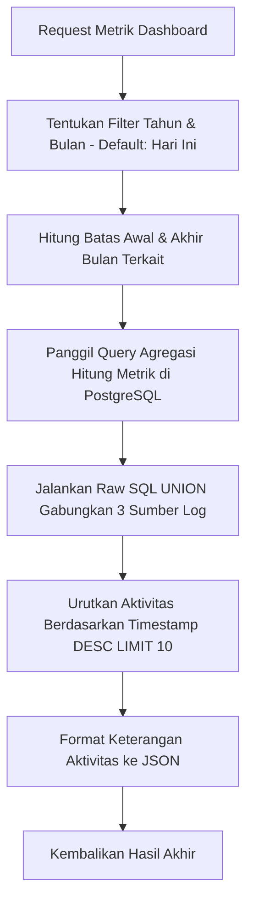

# Penjelasan Logika Bisnis: Dashboard Service (`dashboard_service.go`)

Berkas ini mengelola penarikan metrik statistik operasional bulanan serta log lini masa aktivitas logistik secara terpadu.

---

## 1. Tanggung Jawab Utama
Layanan ini memiliki tanggung jawab utama:
1. **Menghitung Ringkasan Metrik (`GetDashboardMetrics`)**:
   * Menghitung kuantitas total pesanan baru, pesanan selesai, pesanan dalam proses (`pending`, `partial`, `shipped`).
   * Menghitung kuantitas pengiriman berjalan (`dikirim`) vs selesai (`diterima`).
   * Menghitung nominal piutang serta jumlah invoice belum lunas menggunakan fungsi agregasi SQL.
   * Menarik daftar 10 lini masa aktivitas teratas pada bulan terkait.
2. **Penarikan Seluruh Linimasa Terpaginasi (`GetAllDashboardActivities`)**:
   * Menyajikan seluruh log lini masa sistem dengan pencarian berdasarkan filter rentang tanggal, halaman (*page*), dan batas baris (*limit*).

---

## 2. Diagram Alur Logika (Flowchart)



---

## 3. Komponen Teknis Penting untuk Sidang Skripsi

1. **Efisiensi Penggabungan Data (SQL UNION ALL)**:
   * Pada baris **137 - 181**, sistem menggabungkan 3 entitas berbeda (`shipments`, `orders`, `payments`) menjadi satu linimasa menggunakan instruksi `UNION ALL`. Ini memungkinkan pengambilan data log gabungan secara terurut waktu hanya dalam 1 kali eksekusi query database.
2. **Kategori Linimasa Aktivitas Terperinci**:
   * Sistem mendeteksi jenis log aktivitas secara dinamis:
     * **`shipment`**: `Pengiriman Terkonfirmasi` (saat dibuat) $\rightarrow$ `Pengiriman Selesai` (saat diterima).
     * **`order`**: `Pesanan Baru` (saat pending) $\rightarrow$ `Pesanan Selesai` (saat completed).
     * **`payment`**: `Pembayaran Diterima` (saat dicatat) $\rightarrow$ `Pembayaran Diperbarui` (saat diedit/diupdate).
3. **Filter Bulan Dinamis**:
   * Input `monthParam` dan `yearParam` bersifat opsional. Jika klien tidak mengirimkannya, sistem akan membaca waktu server lokal berjalan (`time.Now()`) sebagai parameter default.
4. **Agregasi Nominal Ringkas (`Scan`)**:
   * Jumlah piutang dihitung efisien melalui:
     ```sql
     SELECT COUNT(*) AS count, COALESCE(SUM(remaining_balance), 0) AS amount FROM invoices ...
     ```
     Menjamin tidak terjadi error `NULL` jika tidak ada tagihan belum lunas pada bulan tersebut.
