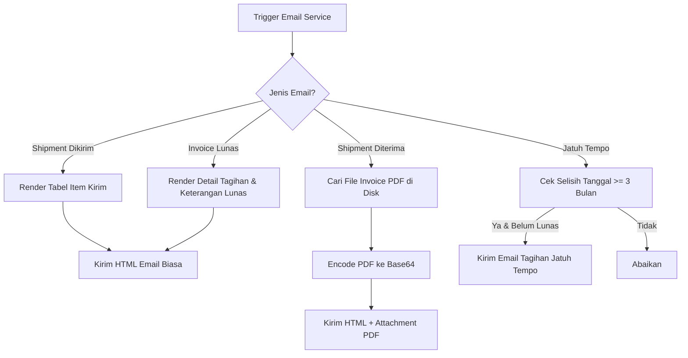

# Penjelasan Logika Bisnis: Email Service (`email_service.go`)

Berkas ini mengelola seluruh pembuatan template HTML dinamis dan pengiriman notifikasi email otomatis kepada pelanggan dan admin sistem.

---

## 1. Tanggung Jawab Utama
Layanan ini memiliki 5 tanggung jawab utama:

1. **Notifikasi Pengiriman Baru (`SendShipmentNotificationEmail`)**:
   * Memberitahukan pelanggan bahwa barang pesanan sedang dalam proses perjalanan oleh kurir.
   * Menampilkan daftar item barang (`ProductName`) dan jumlah kuantitas (`ShippingQty`) yang dikirim dalam bentuk tabel HTML.
2. **Notifikasi Penerimaan Barang & Invoice (`SendShipmentReceivedNotificationEmail`)**:
   * Mengirim email konfirmasi setelah barang sampai dan diterima di lokasi pelanggan.
   * Membaca berkas PDF bukti tagihan resmi dari disk/database (`GetUploadedInvoiceAttachment`) dan melampirkannya langsung ke email.
3. **Notifikasi Pelunasan Invoice (`SendInvoicePaidNotificationEmail`)**:
   * Mengirim email pemberitahuan ketika suatu tagihan (invoice) telah lunas terbayar (`PaymentStatus = paid` / sisa tagihan = 0).
4. **Pengingat Jatuh Tempo Pembayaran (`SendPaymentDueReminderEmail`)**:
   * Memeriksa status pesanan secara berkala. Jika pesanan belum lunas dalam waktu **3 bulan** setelah tanggal pesanan dibuat, sistem akan mengirim email peringatan jatuh tempo pembayaran.
5. **Utilitas Protokol Email (`SendEmail` & `SendEmailWithAttachment`)**:
   * Mengatur header email (From, To, Subject, MIME-Version, Content-Type).
   * Membungkus pengiriman email biasa (HTML biasa) maupun email dengan lampiran berkas biner (Base64 encoding).

---

## 2. Diagram Alur Logika (Flowchart)



---

## 3. Komponen Teknis Penting untuk Sidang Skripsi

1. **Pengiriman Lampiran Biner (Base64 Encoding)**:
   * Pada baris **204 - 264** (`SendEmailWithAttachment`), file PDF dibaca dalam bentuk byte stream, diubah ke format teks **Base64**, lalu dibagi ke dalam potongan teks 76 karakter sesuai standar MIME (`RFC 2045`) sebelum dikirim melalui SMTP.
2. **Pengingat Jatuh Tempo (3 Bulan)**:
   * Pada baris **524 - 550** (`SendPaymentDueReminderEmail`), sistem menghitung tanggal jatuh tempo (`dueDate`) menggunakan formula:
     ```go
     dueDate := orderDate.AddDate(0, 3, 0)
     ```
     Jika hari ini melewati tanggal jatuh tempo dan `RemainingBalance > 0`, email peringatan otomatis dipicu.
3. **Pemberian Format Mata Uang & Tanggal Lokal**:
   * Fungsi internal `formatIDR` mengubah nominal desimal ke format Rupiah (contoh: `Rp 10.000.000,00`).
   * Fungsi `formatDateIndo` mengubah tanggal ISO ke format nama bulan Indonesia (contoh: `30 Juli 2026`).
