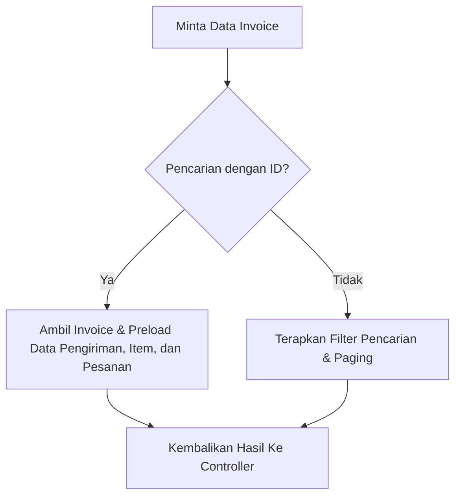

# Penjelasan Logika Bisnis: Invoice Service (`invoice_service.go`)

Berkas ini mengelola penarikan dan pencarian data tagihan (*invoice*) yang terbit di sistem.

---

## 1. Tanggung Jawab Utama
Layanan ini memiliki tanggung jawab utama:
1. **Mengambil Data Tagihan (`GetInvoiceByID`, `GetAllInvoices`)**: Menarik rincian tagihan beserta data pengiriman dan pesanan yang terkait.
2. **Menarik Tagihan Berdasarkan Pengiriman (`GetInvoiceByShipmentID`)**: Menemukan invoice spesifik yang berelasi dengan ID pengiriman tertentu.

---

## 2. Diagram Alur Logika (Flowchart)

---

## 3. Komponen Teknis Penting untuk Sidang Skripsi

1. **Mekanisme Eager Loading (Preload)**:
   * Kolom tagihan berelasi erat dengan tabel lain. GORM menggunakan metode `Preload` untuk mengambil data `Shipment`, `Shipment.Items`, dan `Order` secara efisien dalam satu query gabungan (Join), meminimalkan latensi query ke database (solusi dari masalah N+1 query).
2. **Status Pembayaran Tagihan**:
   * Setiap invoice merekam sisa saldo tagihan (`remaining_balance`) dan status pembayaran:
     * `unpaid`: Belum ada pembayaran teralokasi ke invoice tersebut.
     * `partial`: Sudah dicicil, namun sisa tagihan masih > 0.
     * `paid`: Sisa tagihan = 0 (lunas).
3. **Penyajian Data Riwayat Terintegrasi**:
   * Memudahkan Admin memantau dokumen tagihan mana saja yang belum dilunasi oleh pelanggan dari data rekap operasional.
