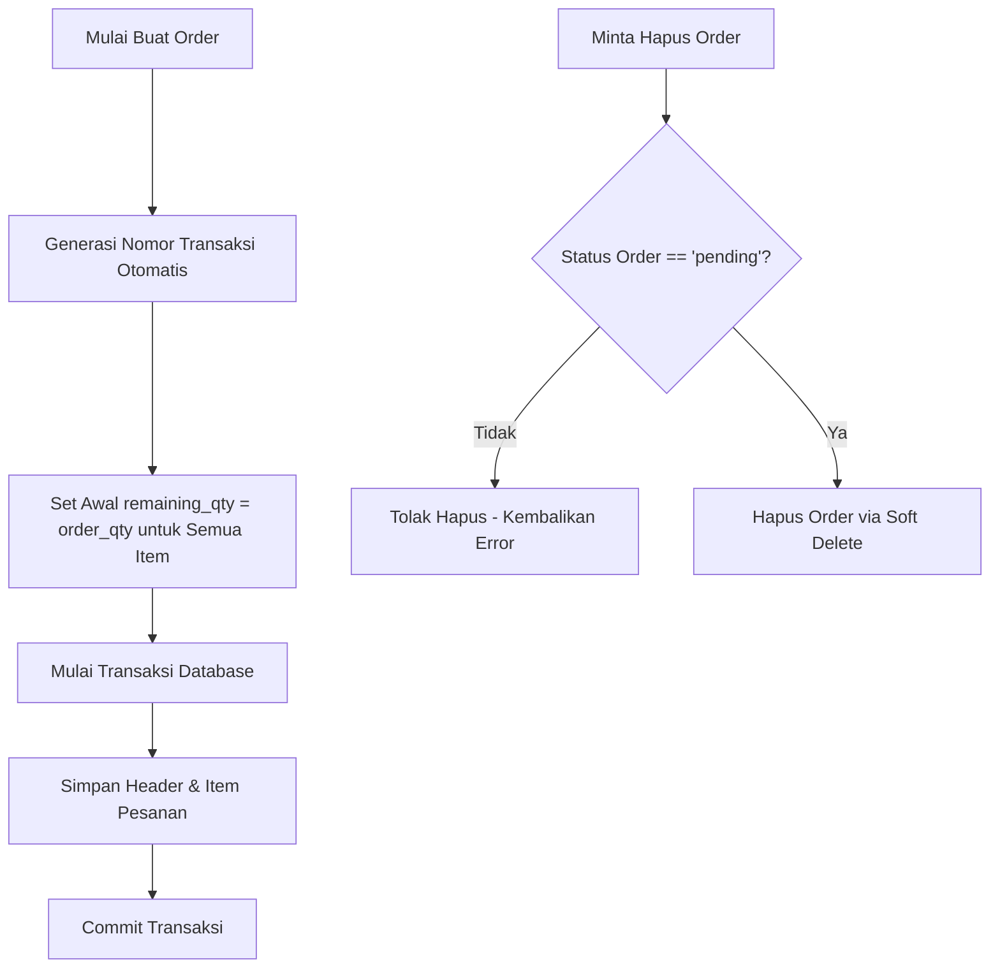

# Penjelasan Logika Bisnis: Order Service (`order_service.go`)

Berkas ini mengelola siklus hidup pesanan pembelian (*Purchase Order*) dari pelanggan.

---

## 1. Tanggung Jawab Utama
Layanan ini memiliki tanggung jawab utama:
1. **Membuat Pesanan (`CreateOrder`)**: Mencatat pesanan baru, item barang beserta harga dan kuantitas awal.
2. **Nomor Transaksi Otomatis (`GetNextTransactionNo`)**: Menghasilkan nomor transaksi urut secara otomatis dengan format: `NF/WT/{RunningNumber}/{Tahun}`.
3. **Pembaruan Status (`updateOrderStatus`)**: Menghitung sisa kuantitas barang pesanan dan memperbarui status pesanan secara dinamis berdasarkan barang yang sudah terkirim.
4. **Validasi Penghapusan (`DeleteOrder`)**: Menghapus data pesanan dengan proteksi status (hanya pesanan berstatus `pending` yang boleh dihapus).

---

## 2. Diagram Alur Logika (Flowchart)

---

## 3. Komponen Teknis Penting untuk Sidang Skripsi

1. **State Machine Status Pesanan**:
   * Status pesanan berpindah secara otomatis sesuai dengan aktivitas logistik pengiriman barang:
     * `pending`: Belum ada barang dikirim sama sekali.
     * `partial`: Sebagian barang telah dikirim (terdapat sisa kuantitas yang belum dikirim).
     * `shipped`: Seluruh kuantitas barang pesanan telah dikirim sepenuhnya ke kurir.
     * `completed`: Seluruh barang yang dikirim telah sampai dan dikonfirmasi diterima oleh pelanggan.
2. **Generasi Nomor Urut Dinamis**:
   * Sistem mendeteksi tahun berjalan secara otomatis dan mencari nomor urut terakhir pada database PostgreSQL untuk transaksi pada tahun tersebut, kemudian menambahkannya 1 (`RunningNumber + 1`).
3. **Integritas Sisa Stok Pesanan (`remaining_qty`)**:
   * Setiap item pesanan merekam data kuantitas yang dipesan (`order_qty`) dan kuantitas sisa yang belum terkirim (`remaining_qty`). Nilai `remaining_qty` inilah yang menjadi batas maksimum kuantitas pada saat pengiriman barang dibuat.
4. **Proteksi Mutasi Data**:
   * Mencegah penghapusan pesanan yang sudah memiliki riwayat pengiriman (`shipments`) atau tagihan (`invoices`) untuk menjaga konsistensi keuangan di database.
