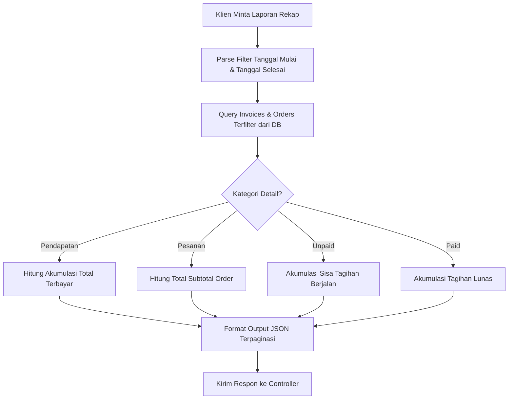

# Penjelasan Logika Bisnis: Payment Recap Service (`payment_recap_service.go`)

Berkas ini bertanggung jawab untuk memproses rekapitulasi data keuangan, pelaporan ringkasan nominal piutang, dan rincian transaksi (pendapatan, pesanan, tagihan belum lunas, dan tagihan lunas).

---

## 1. Tanggung Jawab Utama
Layanan ini memiliki tanggung jawab utama:
1. **Menghitung Rekap Ringkasan (`GetPaymentRecapSummary`)**: Mengagregasi data pemasukan keseluruhan, jumlah pesanan, tagihan belum dibayar, tagihan lunas, dan persentase kelunasan dalam rentang waktu terfilter.
2. **Menyusun Rincian Laporan Transaksi**:
   * `GetDetailPendapatan`: Penarikan tagihan-tagihan lunas atau cicilan aktif beserta nominal pemasukan kotornya.
   * `GetDetailPesanan`: Penarikan daftar pesanan masuk beserta nominal kotor order.
   * `GetDetailUnpaid`: Penarikan khusus daftar tagihan (invoice) berstatus `unpaid` atau `partial` (piutang aktif).
   * `GetDetailPaid`: Penarikan khusus daftar tagihan yang sudah terbayar lunas (`paid`).

---

## 2. Diagram Alur Logika (Flowchart)

---

## 3. Komponen Teknis Penting untuk Sidang Skripsi

1. **Pemisahan Logika Query dan Format Excel**:
   * Perekapan database diproses di `payment_recap_service.go` untuk mendapatkan data array terstruktur. Pembuatan dokumen fisik spreadsheet (`.xlsx`) dilakukan di tingkat controller `payment_recap_controller.go` menggunakan pustaka Excelize.
2. **Optimasi Kinerja Database dengan Custom Join**:
   * Untuk menghindari query berulang, sistem menyatukan tabel `invoices`, `shipments`, dan `orders` menggunakan query `Joins()` dari GORM. Dengan metode ini, pemfilteran nama penerima (`recipient_name`) dan rentang tanggal pesanan (`order_date`) dapat dieksekusi dengan cepat di sisi database.
3. **Mekanisme Pagination di Sisi Database**:
   * Fungsi helper `queryInvoicesPage` menggunakan klausa `.Limit()` dan `.Offset()` SQL untuk membatasi jumlah data yang ditarik per halaman, menghemat penggunaan memori RAM server saat menangani data transaksi berjumlah ribuan.
