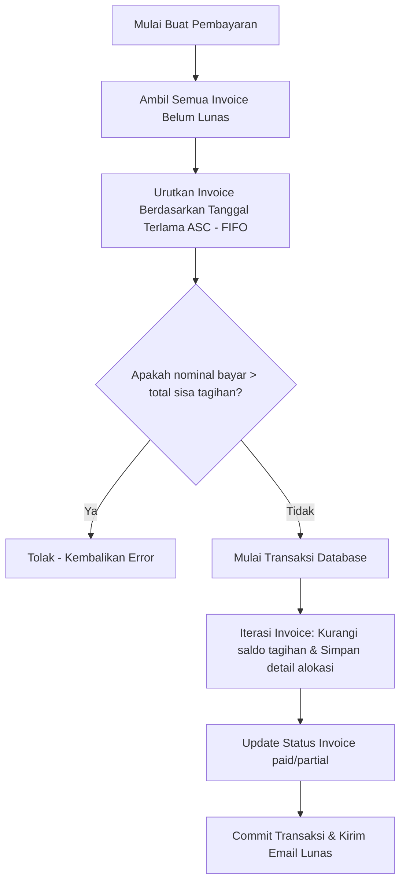
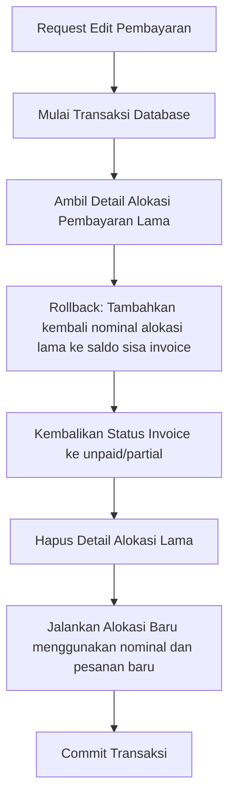

# Penjelasan Logika Bisnis: Payment Service (`payment_service.go`)

Berkas ini mengelola seluruh urusan pencatatan pembayaran dari pelanggan, alokasi otomatis ke tagihan, serta pembatalan alokasi saat nominal pembayaran diedit.

---

## 1. Tanggung Jawab Utama
Layanan ini memiliki tanggung jawab utama:
1. **Pencatatan Pembayaran (`CreatePayment`)**: Menyimpan data pembayaran dan membaginya secara otomatis ke tagihan-tagihan terkait.
2. **Pembaruan Pembayaran (`UpdatePaymentTotal`)**: Menghitung ulang dan mengalokasikan kembali pembayaran jika nominal atau pesanan berubah.
3. **Pencarian Histori Pembayaran (`GetPaymentHistory`, `SearchCustomerPayments`)**: Menyediakan rekap data pembayaran per customer dan filter rentang waktu.

---

## 2. Diagram Alur Logika (Flowchart)

### Pembuatan Pembayaran (Alokasi FIFO)

### Pembaruan/Edit Pembayaran (Rollback & Reallocate)

---

## 3. Komponen Teknis Penting untuk Sidang Skripsi

1. **Algoritma FIFO (First In First Out) Kronologis**:
   * Menjamin transparansi pembukuan. Dana pembayaran secara otomatis melunasi tagihan yang paling lama terlebih dahulu sehingga tidak ada tagihan menggantung yang terlewat.
2. **Mekanisme Rollback Keadaan Lama (Revert State)**:
   * Saat nominal pembayaran diedit, sistem tidak langsung mengubah angka alokasi secara acak. Sistem memulihkan terlebih dahulu seluruh invoice terdampak ke saldo semula sebelum pembayaran tersebut terjadi, menghapus log alokasi lama, baru kemudian mengalokasikan ulang nominal pembayaran yang baru. Hal ini mencegah terjadinya *selisih angka* pembukuan.
3. **Presisi Matematika Desimal (`roundTwo`)**:
   * Menghindari masalah *floating-point error* bawaan bahasa pemrograman saat melakukan operasi matematika pecahan desimal pada uang dengan selalu membulatkan hasil perhitungan saldo ke dua angka desimal.
