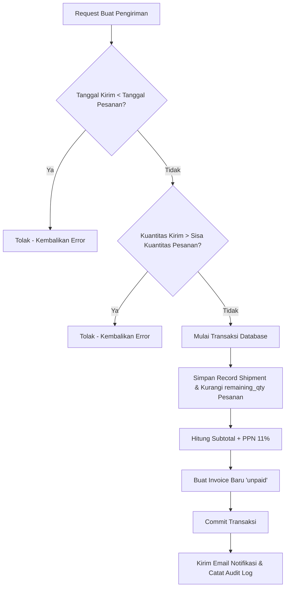

# Penjelasan Logika Bisnis: Shipment Service (`shipment_service.go`)

Berkas ini mengelola pengiriman barang dari pesanan (*orders*) ke lokasi pelanggan, termasuk konfirmasi penerimaan fisik dan otomatisasi pembuatan invoice.

---

## 1. Tanggung Jawab Utama
Layanan ini memiliki tanggung jawab utama:
1. **Membuat Pengiriman Baru (`CreateShipment`)**: Mencatat pengiriman barang (parsial atau penuh) dan validasi kelayakan pengiriman.
2. **Otomatisasi Tagihan (Invoice Generator)**: Menerbitkan invoice secara otomatis sesaat setelah pengiriman berhasil disimpan.
3. **Konfirmasi Penerimaan (`ConfirmShipmentReceived`)**: Mencatat tanggal barang tiba di pelanggan dan memperbarui status pengiriman menjadi diterima.
4. **Pembaruan Pengiriman (`UpdateShipmentItems`)**: Memungkinkan penyuntingan kuantitas barang terkirim dengan kalkulasi ulang saldo invoice otomatis.

---

## 2. Diagram Alur Logika (Flowchart)

---

## 3. Komponen Teknis Penting untuk Sidang Skripsi

1. **Validasi Kronologis Logistik**:
   * Sistem menolak pengiriman jika `shipping_date` tercatat sebelum `order_date`. Ini adalah aturan bisnis logistik untuk mencegah kesalahan entri tanggal.
2. **Validasi Kuantitas Parsial**:
   * Sistem memastikan kuantitas barang yang dikirim dalam satu atau beberapa pengiriman parsial tidak pernah melebihi total kuantitas barang yang dipesan pelanggan di awal.
3. **Otomatisasi Invoice Terintegrasi**:
   * Ketika barang dikirim, tagihan langsung terbuat secara otomatis dalam satu transaksi database tunggal (*atomic transaction*). Dengan demikian, tidak ada celah terjadinya pengiriman barang tanpa tagihan yang terbentuk (*data mismatch*).
4. **Pengiriman Email Notifikasi Latar Belakang**:
   * Setelah transaksi database sukses di-commit, pengiriman email notifikasi diproses di latar belakang menggunakan goroutine agar tidak mengganggu kecepatan respon aplikasi bagi pengguna.
5. **Mekanisme Konfirmasi Penerimaan**:
   * Status pengiriman dikonfirmasi dari `dikirim` menjadi `diterima`. Jika semua pengiriman untuk pesanan tersebut sudah `diterima` dan kuantitas barang sudah terkirim habis, sistem secara otomatis mengubah status pesanan terkait menjadi `completed`.
